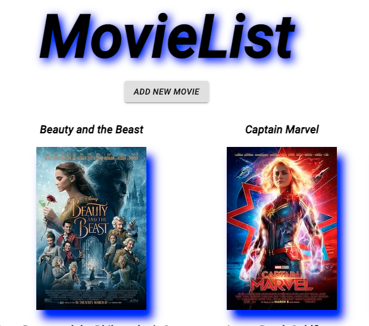
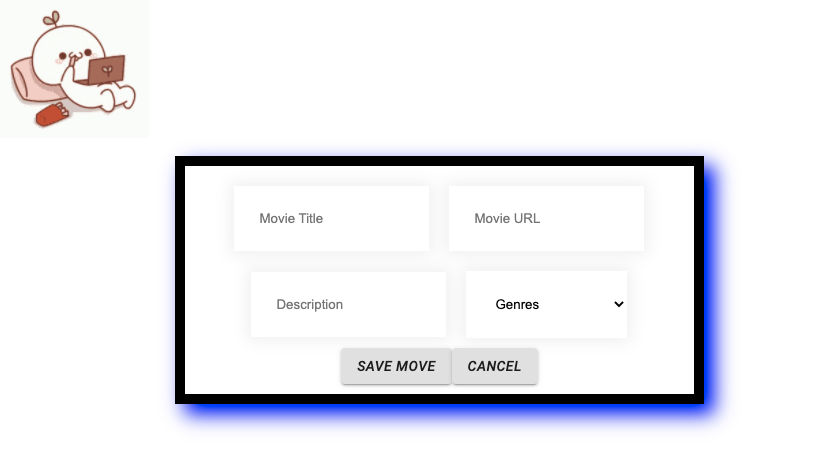

# Project Name

An web app that shows a list of movies with titles and a poster of the movie. When the picture is clicked it will show the detail of the movie with it's genre. Users can also add new movies to the list when click on the add movie button. When you click cancel it will take you back to the home page. 

## Description

Problems I came across was getting the genres store to map correctly. After a while I was able realize that I did not need to use .map and to just call it without .map.

Home Page

Movie List Page

Details Page

Add Movie Page

